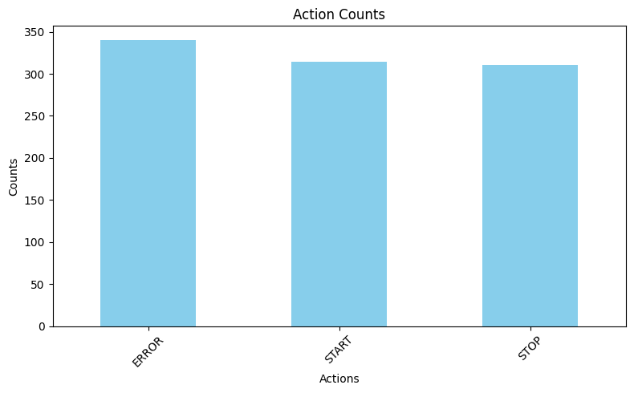

# IOT_LOG_PARSER45
smart city assessment
## Project Overview
- Brief description of the project, including its purpose and functionality.
- Mention the problem statement and how your solution addresses it.

## Features
- Data extraction and structuring.
- Base64 image decoding and visualization.
- Web server log parsing.
- Error handling.
- Dashboard with charts/graphs.

## Setup
- Clone the repository.
- Open the notebook in Google Colab or Jupyter Notebook.
- Upload your log file and run the cells.
## Output Files
- *structured_data1.csv*: Parsed data.
- *error_log1.txt*: Errors encountered at the time of parsing.
- *visualization.png*: Data visualization.

## Assumptions
### Log File Format
1. Each log entry contains key-value pairs (e.g., Temperature=28.92).
2. Missing values are represented as null or omitted entirely.

### Base64 Images
1. Base64-encoded images are identified by specific tags (e.g., ImageData).
2. Supported image formats:
   - PNG
   - JPEG

### Web Server Log
1. Apache/Nginx logs are provided in standard formats (e.g., Common Log Format).

### Error Handling
1. Invalid log entries are skipped but logged for reference.
2. Critical errors are reported with file and line numbers.
## Image 

